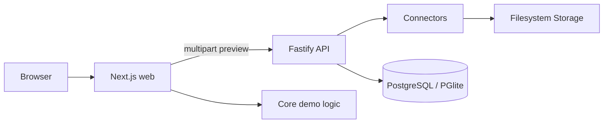

# Arquitectura

## Estructura del monorepo

- `apps/web`: Next.js 15 App Router, páginas operativas y demos de dominio.
- `apps/api`: Fastify, OpenAPI y vista previa de importaciones.
- `packages/core`: lógica de matching y regalías segura para navegador.
- `packages/core/server`: storage, PDF, expedientes y VERI*FACTU mock para Node.js.
- `packages/db`: esquema Drizzle, migraciones y repositorios cableados a la API.
- `packages/connectors`: parsers Shopify CSV/PDF y Amazon KDP XLSX.
- `packages/tax-engine`: reglas fiscales versionadas y `DEMO_CONFIG`.
- `packages/ui`: tokens y componentes compartidos.

## Procesos y límites

Turborepo coordina dos procesos: web en el puerto 3000 y API en el 3001. La
separación `@anclora/core` / `@anclora/core/server` evita incluir módulos Node
en componentes cliente.

## Flujos reales

La importación sí realiza un recorrido navegador → API → conector → storage.
Operaciones, conciliación, facturación, VERI*FACTU, periodos, asesoría y gastos
consultan datos tenant-scoped. La demo VERI*FACTU solo aparece en modo mock
aislado y se etiqueta como sintética.

## Restricciones operativas

No se usa Docker, Redis, MinIO ni Chromium para PDF. PGlite está disponible
para pruebas offline y PostgreSQL serverless para una integración futura.
