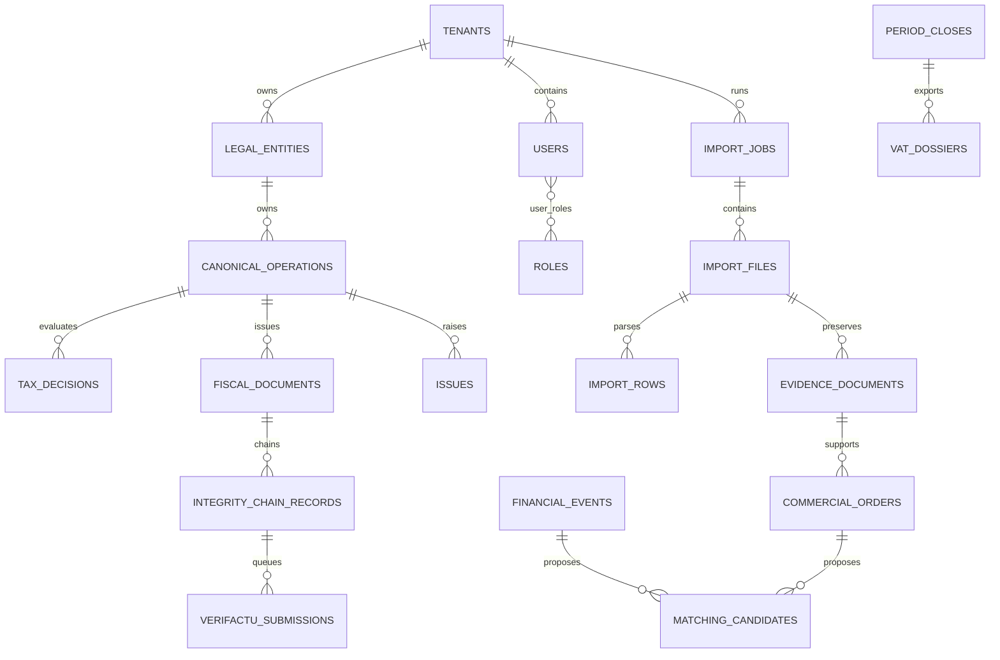

# Modelo de datos

## Estado

El esquema usa PostgreSQL mediante Drizzle y cinco migraciones incrementales.
Está definido en `packages/db/src/schema.ts`, pero todavía no se usa desde la
API. Los importes emplean `numeric` y todas las tablas operativas incluyen
`tenant_id`.

## Grupos de tablas

- Identidad: `tenants`, `legal_entities`, `users`, `roles`, `permissions`,
  `user_roles`, `audit_events`.
- Configuración: `fiscal_configurations`, `invoice_series`.
- Importación: `import_jobs`, `import_files`, `import_rows`, `import_errors`,
  `evidence_documents`.
- Operaciones: `commercial_orders`, `financial_events`,
  `canonical_operations`, `matching_candidates`, `issues`.
- Fiscal: `tax_decisions`, `fiscal_documents`, `integrity_chain_records`,
  `verifactu_submissions`.
- Cierre: `period_closes`, `vat_dossiers`.

## Relaciones principales

## Integridad y aislamiento

Índices únicos protegen slugs, referencias externas, hashes y números de
factura dentro de su ámbito. El aislamiento por tenant está modelado, pero no
puede considerarse aplicado hasta que la API use repositorios persistentes.

