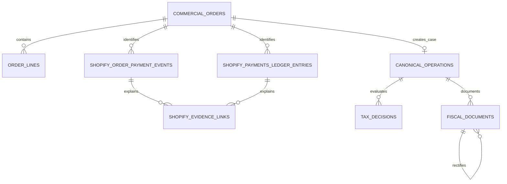

# Modelo de datos

## Estado

PostgreSQL y Drizzle usan migraciones versionadas 0001–0017. La API de
producción conecta repositorios reales; todas las tablas operativas incluyen
`tenant_id` y los importes usan `numeric`.

## Tablas Shopify

| Tabla | Responsabilidad |
| --- | --- |
| `commercial_orders` | Pedido, estado comercial, cliente e importes fuente. |
| `order_lines` | Líneas idempotentes y trazables del pedido. |
| `shopify_order_payment_events` | Eventos de pago/reembolso por pedido. |
| `shopify_payments_ledger_entries` | Ledger, fee, neto y datos de payout. |
| `payouts` | Sólo referencias con `external_payout_id` real. |
| `shopify_evidence_links` | Enlaces exactos, propuestos y decididos. |
| `canonical_operations` | Expediente fiscal derivado del pedido confirmado. |
| `tax_decisions` | Resultado fiscal versionado y explicado. |
| `fiscal_documents` | Facturas y rectificativas inmutables. |

## Configuración fiscal

| Tabla | Responsabilidad |
| --- | --- |
| `legal_entities` | Emisor fiscal único: nombre legal, marca, domicilio, NIF/NIE cifrado, IAE, régimen IVA y OSS. |
| `invoice_series` | Series independientes `FS`, `F` y `FR`, con numeración atómica por emisor. |
| `product_tax_profiles` | Naturaleza fiscal del producto, tipo nacional y fecha de vigencia. |
| `fiscal_counterparties` | Contrapartes sólo cuando una factura completa o validación B2B lo requiere. |

## Relaciones

## Idempotencia y aislamiento

Pedidos, líneas, eventos, ledger y enlaces tienen claves únicas tenant-scoped.
Reimportar el mismo export no duplica entidades. Los repositorios y
controladores derivan el tenant de la sesión y prueban aislamiento cruzado.

Una transacción Shopify de cobro confirmada crea el expediente fiscal y puede
emitir si la decisión es `DETERMINADA`. Ledger, payout y banco permanecen como
evidencias de liquidación separadas y no son requisito para consumir numeración.
